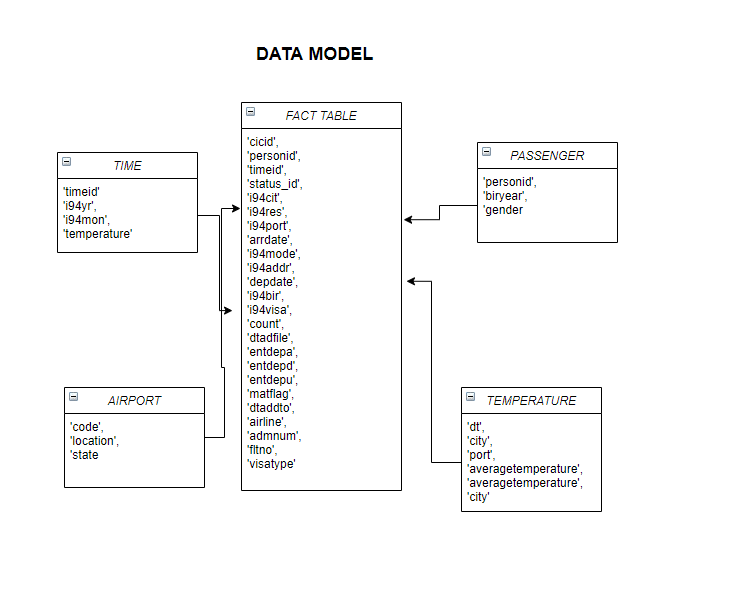

# Udacity Data Engineering Project

This project makes use of pyspark to extract data and organize then into a snowflack schema database composed of fact and dimention tables.
It extracts data from parquet files and csv files.

# US Immigration Data

### Data Engineering Capstone Project

#### Project Summary
This project aims to use techniques learned in the Udacity Nanodegree course on Data Engineer to create a fact and dimension tables regarding US immigration data, together with analysis on temperature and airport characteristics. Here we will use two formats of data (SAS and .csv) to build FACT and dimension tables, splitting the US immigration dataset in regards to what are its informations about (flight? passenger?), and add informtion on temperature on the dates observed.

# Dataset 1: I94 Immigration Data from the US National Tourism and Trade Office 

- Is the data that will be used to build our FACT table. It contains information on airline, visatipe, destination of people immigrating to the US.
- Firstly we will check for missing data, check if the data is behaving as expected and transform the data where necessary.
- This dataset has around 3 million lines and 28 columns. We will limit the columns to those we are interested in and explore how to break it into new tables when relevant
- This data is updated monthly
- For this project I opted for deleting columns with more than 30% of its values being null. However, it is expected that cases with null values happen in data engineering projects, and this is one of many possible approaches.
- In this dataset we have a lot of infomations, we can split it in regards to what the informations are about.
- We make use of draw.io to build visualization for the schema
- I will allow nan values to continue as nan, without replacement techniques

# Dataset 2: Temperature
- Temperature by city and date

# Dataset 2: Airport 
- Code
- Location
- State

# Technologies and Tools 

Here I opted for using pyspark and take a vantage of parallem processing.

# Steps:

- Create an enviroment for the project
- Install the following packages: Pandas, Re, Pyspark, Numpy.
- Run Capstone Project Template.ipynb (example: by using Vscode and checking that the kernel refers to the diserd environment)

# Goal:

Create this data model from the initial datasets described avobe:

## Example of Analysis with Data Model:
- Check temperature on arrival date of a passanger 
- Check temperature on port on the date level
- Correlate passanger and find out if there are indiations of preference regarding temperature for choosing fligh date
